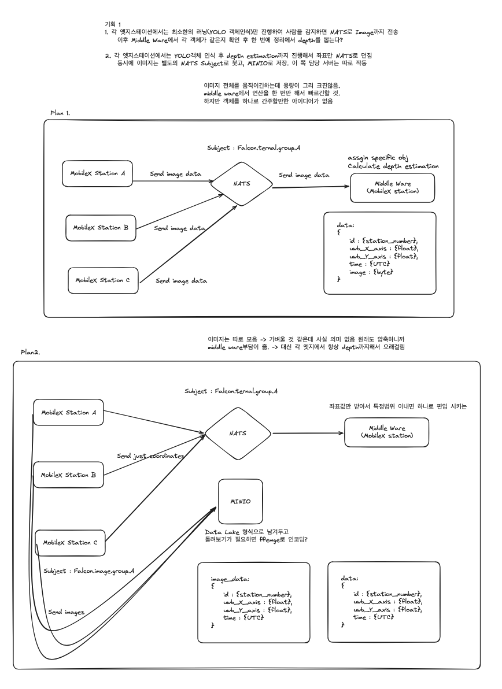
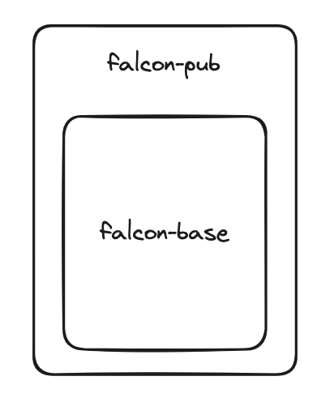

## Infra.


<details>
<summary>Previous</summary>
<div markdown="1">



초기 진행에 관한 자료 링크

[falcon에 관한 초기 아이디어](https://github.com/NetAiFalcon/falcon/tree/nats/initial_meterial)

</div>
</details>

## pub

python3 main.py --tag_id {int}

## Sub

NATS를 경유해서 값을 받고, kafka를 이용해 토픽을 전달
(falcon은 NATS 중심의 메세지큐를 사용하지만 MobileX 및 Digital Twin은 kafka를 사용하기 때문.)

## Dockerfile

한 번에 도커파일을 빌드할 경우 1000초 이상의 시간이 소요되기 때문에

falcon-base

falcon-pub

로 나누어 빌드함.

결과적으로 기존 1000s 이상 걸리는 빌드를 600s -> 400s -> < 3s 으로 단축함.



### Dockerfile build

```bash
sudo docker build -t falcon-base-torch-12.1-pub-base -f dockerfile_falcon-base .
```

```bash
sudo docker build -t falcon-pub -f dockerfile_falcon-pub .
```

### Docker run

```bash
sudo docker run -e NVIDIA_VISIBLE_DEVICES=all -e NVIDIA_DRIVER_CAPABILITIES=all --net=host --env="DISPLAY" --device=/dev/snd:/dev/snd --device=/dev/video0:/dev/video0 --device=/dev/video1:/dev/video1 --device=/dev/media0:/dev/media0 -i -t -v /etc/localtime:/etc/localtime:ro -v /usr/lib:/usr/lib --gpus=all --replace --name=falcon-pub-tset localhost/falcon-pub
```

# AI Refer.

## Unidepth

### Contributions

If you find any bug in the code, please report to Luigi Piccinelli (lpiccinelli@ethz.ch)

### Citation

If you find our work useful in your research please consider citing our publication:

```bibtex
@inproceedings{piccinelli2024unidepth,
    title     = {{U}ni{D}epth: Universal Monocular Metric Depth Estimation},
    author    = {Piccinelli, Luigi and Yang, Yung-Hsu and Sakaridis, Christos and Segu, Mattia and Li, Siyuan and Van Gool, Luc and Yu, Fisher},
    booktitle = {Proceedings of the IEEE/CVF Conference on Computer Vision and Pattern Recognition (CVPR)},
    year      = {2024}
}
```

### License

This software is released under Creatives Common BY-NC 4.0 license. You can view a license summary [here](LICENSE).

### Acknowledgement

We would like to express our gratitude to [@niels](https://huggingface.co/nielsr) for helping intergrating UniDepth in HuggingFace.

This work is funded by Toyota Motor Europe via the research project [TRACE-Zurich](https://trace.ethz.ch) (Toyota Research on Automated Cars Europe).
